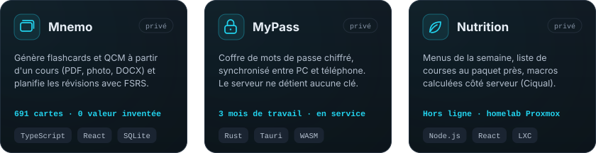
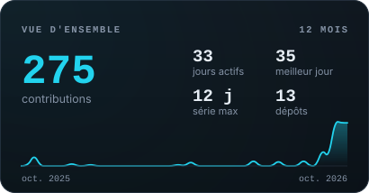
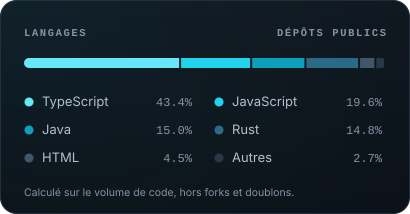

<a name="top"></a>

<div align="center">


`luca@brest:~$ cat README.md`

<a href="https://git.io/typing-svg"></a>

<a href="mailto:lucaauvray@gmail.com"></a>
<a href="https://linkedin.com/in/luca-auvray"></a>


[Profil](#profil) • [Compétences](#stack) • [Projets](#projets) • [Activité](#activite) • [Parcours](#parcours) • [Progression](#progression) • [Contact](#contact)

</div>


<a name="profil"></a>
## 01 — whoami

```powershell
PS C:\Users\luca> Get-Candidat | Format-List

Nom        : Luca Auvray
Formation  : BTS SIO option SISR (2e année) — Lycée Charles de Foucauld, Brest
Parcours   : PASS Médecine → Licence Biologie → Informatique & réseaux
Focus      : {Infrastructure, Cloud (Azure), Sécurité, Automatisation}
Recherche  : Alternance dès septembre 2027 (cursus bac+5) — Brest & environs
Langues    : {Français: natif, Anglais: B1, Espagnol: A2}
Mobilité   : Permis B
```

Après un parcours scientifique exigeant (Médecine, Biologie), je me suis réorienté vers l'informatique et les infrastructures. En **BTS SIO SISR**, je monte des environnements **Linux**, **Windows Server** et **Proxmox**. J'automatise ce qui peut l'être en **PowerShell**, **Bash** et **Python**, et en stage j'ai travaillé sur l'automatisation d'une infrastructure **Azure**.

À côté des cours, je conçois et j'**héberge mes propres applications** sur mon homelab : conteneurs LXC, accès privé par Tailscale, déploiements scriptés, sauvegardes. C'est là que j'apprends le plus.

**En bref**

- 🎯 Je cherche une **alternance en cloud / infrastructure / sécurité**, à partir de **septembre 2027**, pour un cursus bac+5
- 🏗️ Je ne me contente pas de développer : je **déploie, sécurise et exploite** ce que je construis (systemd, nginx, tunnels, sauvegardes)
- 🔬 Mon passé scientifique m'a donné une **rigueur de protocole** : procédures suivies, documentées, mesurées
- 🧪 Je dépanne avec une **démarche de diagnostic** : hypothèse, test, isolement de la cause

<a name="stack"></a>
## 02 — stack

<div align="center">


</div>

| Domaine | Compétences |
|:--|:--|
| 🖥️ **Systèmes & virtualisation** | `Linux` `Debian` `Windows Server` `Proxmox` `LXC` `systemd` `nginx` `VirtualBox` `Docker (notions)` |
| ☁️ **Cloud** | `Azure` `Automatisation d'infrastructure` |
| 🌐 **Réseaux & sécurité** | `IPv4` `VLAN` `Routage` `Commutation` `Tailscale` `Cloudflare Tunnel` `TLS` `Chiffrement (AES-GCM, Argon2)` |
| ⚙️ **Scripting & dev** | `PowerShell` `Bash` `Python` `Rust` `TypeScript` `React` `Node.js` `SQLite` |
| 🔧 **Outils** | `SSH` `Git` `VS Code` `Claude Code` |

<a name="projets"></a>
## 03 — projets

Trois projets personnels, **conçus, déployés et utilisés au quotidien**. Le code est écrit avec Claude Code que je pilote : je m'occupe de la conception, des choix techniques, du déploiement et de l'exploitation.

<p align="center">
  
</p>

| Projet | Ce que c'est | Ce que ça montre | Stack |
|:--|:--|:--|:--|
| **🧠 Mnemo** | App de révision : à partir d'un cours (PDF, photo, DOCX…), génère des flashcards et des QCM et planifie les révisions avec **FSRS** | Un pipeline IA **vérifié en code** plutôt que « espéré » : 9 cours de référence, couverture de 93 à 95 %, 0 valeur inventée sur 691 cartes. Déploiement scripté, sauvegarde de la base avant chaque mise à jour | `TypeScript` `React` `Express` `SQLite` `nginx` `systemd` |
| **🔐 [MyPass](https://github.com/LucaAuvray/MyPass)** | Gestionnaire de mots de passe : un seul coffre chiffré, synchronisé entre mes PC et mon téléphone | **Sécurité applicative** et auto-hébergement : le serveur ne détient aucune clé, rien n'est exposé sur Internet. 3 mois de travail, en service sur mes appareils | `Rust` `Tauri` `WebAssembly` `Axum` `Tailscale` |
| **🥗 Nutrition** | App iPhone de repas de la semaine : menu composé par Claude, liste de courses au paquet près, suivi des macros, utilisable hors ligne | Une **chaîne complète** sur mon homelab : conteneur LXC sur Proxmox, tâches planifiées, déploiement scripté, accès privé par Tailscale. Les macros sont calculées par le serveur (table Ciqual), jamais par le modèle | `Node.js` `React` `Proxmox` `LXC` `Tailscale` |

<details>
<summary><b>🧠 Mnemo — le détail</b></summary>

<br/>

- **Le pari** : un deck qui rate une notion fait rater une question d'examen ; un deck qui la pose trois fois fait perdre du temps. Presque tout le code non trivial sert à tenir les deux bouts.
- **Génération vérifiable** : le cours est découpé en blocs, le modèle inventorie les notions, puis rend une carte par notion. La couverture devient mesurable : deux cartes sur la même notion sont un doublon, une notion sans carte est un trou nommé.
- **Principe** : une consigne dans un prompt ne garantit jamais un comportement. On fait déclarer au modèle ce qu'il a fait, puis on le **vérifie en code**.
- **Tests** : 195 tests hors ligne (génération, planification, journée de révision), sans réseau ni quota. Coût d'un corpus entier : environ 0,19 $.
- **Exploitation** : service `systemd` derrière `nginx` et un tunnel Cloudflare. Le script `deploy.sh` joue les tests, construit, sauvegarde la base, redémarre puis attend le `/api/health`.
- **Architecture** : front React 19 + Vite + Tailwind, calcul FSRS côté client ; backend Express + SQLite + JWT qui sert aussi de proxy vers les fournisseurs d'IA, donc la clé ne touche jamais le navigateur.

</details>

<details>
<summary><b>🔐 MyPass — le détail</b></summary>

<br/>

- **Le problème** : un gestionnaire complet (2FA, clés SSH, remplissage dans le navigateur) sans confier le coffre à un tiers ni l'exposer sur Internet.
- **La solution** : le coffre est un seul fichier chiffré (AES-256-GCM ou ChaCha20-Poly1305, dérivation Argon2) que chaque appareil déchiffre en local avec un **noyau Rust écrit une seule fois**. Un petit serveur Axum, hébergé dans un conteneur LXC sur Proxmox, ne garde que des copies chiffrées et versionnées. Les appareils lui parlent par Tailscale.
- **Difficulté principale** : faire tourner le même noyau Rust en natif (Tauri) **et** dans le navigateur (WebAssembly) : horloge, aléatoire, dépendances incompatibles avec la cible `wasm32`.
- **Fonctionnalités** : tableau de bord sécurité (mots de passe faibles, réutilisés, fuites via HIBP), codes TOTP, agent SSH Windows, extension Chrome/Edge, mises à jour automatiques par `.msi` signé.
- **Liens publics** : [code source](https://github.com/LucaAuvray/MyPass) (open source, licence MIT) • [extension navigateur](https://github.com/LucaAuvray/mypass-browser-extension) (fork de KeePassXC-Browser) • [installeur Windows](https://github.com/LucaAuvray/mypass-downloads) • [politique de confidentialité](https://github.com/LucaAuvray/mypass-privacy)

</details>

<details>
<summary><b>🥗 Nutrition — le détail</b></summary>

<br/>

- **Le principe** : le jeudi soir, Claude compose les cinq repas de la semaine suivante à partir du stock déjà présent, du budget (environ 2 € par repas) et des goûts. L'app en déduit la liste de courses exacte, au paquet près.
- **Garde-fous** : la sortie du modèle est contrainte par un schéma JSON qui n'autorise que des ingrédients achetables, puis revalidée. Un ingrédient refusé ne peut physiquement plus apparaître dans une recette.
- **Serveur** : Node.js, bibliothèque standard uniquement, aucune dépendance ; données en JSON écrites de façon atomique.
- **Infra** : conteneur LXC sur Proxmox, tâches `cron`, `deployer.sh`, notifications. Rien n'est exposé : l'app n'est joignable que depuis mon réseau Tailscale, qui fournit aussi le HTTPS nécessaire au service worker.
- **Tests** : scripts Node sans framework qui échouent bruyamment.

</details>

> 🔓 **MyPass est open source** : le code est public sur [LucaAuvray/MyPass](https://github.com/LucaAuvray/MyPass) (licence MIT).
>
> 🔒 Mnemo et Nutrition sont des dépôts privés. Je peux montrer le code et les démos en entretien.

**Autres dépôts :** [⚽ KZ United](https://github.com/LucaAuvray/kz-united) (site du club de foot que je gère à Brest : Next.js, Prisma, PostgreSQL) • [✍️ Prompteur](https://github.com/LucaAuvray/prompteur) (extension Chrome qui réécrit les prompts) • [🗓️ IAgenda](https://github.com/LucaAuvray/IAgenda) (PWA d'agenda pour étudiants, PHP / MariaDB)

<a name="activite"></a>
## 04 — activité

<p align="center">
  
  
</p>

<sub>Cartes régénérées chaque jour par GitHub Actions. Le code qui les produit est dans <a href="scripts/build_profile.py"><code>scripts/build_profile.py</code></a>.</sub>

<a name="parcours"></a>
## 05 — parcours

| Période | Diplôme / expérience | Établissement |
|:--|:--|:--|
| **2025 → en cours** | **BTS SIO — option SISR** | Lycée Charles de Foucauld, Brest |
| Stage BTS | Automatisation d'infrastructure **Azure** & réseau | Trecobat (groupe de construction) |
| 2021 → 2025 | Licence Biologie BCMP (L2 & L3) | UBO, Brest |
| 2021 | PASS Médecine | UBO, Brest |
| 2020 | Licence Biologie BCMP (L1) | UBS, Vannes |
| 2019 | Bac Scientifique | Lycée A. R. Lesage, Vannes |

<a name="progression"></a>
## 06 — progression

- [x] Bases Linux & Windows Server
- [x] Virtualisation : Proxmox (cluster, conteneurs LXC), VirtualBox
- [x] Scripting Bash & PowerShell
- [x] Adressage IPv4, VLAN, routage & commutation
- [x] Auto-héberger et exploiter mes services : systemd, nginx, Tailscale, Cloudflare Tunnel
- [x] Premiers pas en automatisation Azure (stage)
- [ ] Docker : passer des notions à la mise en production
- [ ] Certifications cloud
- [ ] Approfondir la cybersécurité
- [ ] Documenter mon homelab complet sur GitHub


<a name="contact"></a>
## 07 — contact

<div align="center">

**Une entreprise qui accueille un alternant cloud / infra / sécurité à partir de septembre 2027 ? Écrivez-moi.**

<a href="mailto:lucaauvray@gmail.com"></a>
<a href="https://linkedin.com/in/luca-auvray"></a>
<a href="https://lauvray.info"></a>

<sub>⚽ Football · 💪 Musculation · 💻 Homelab</sub>

<a href="#top"></a>


</div>
